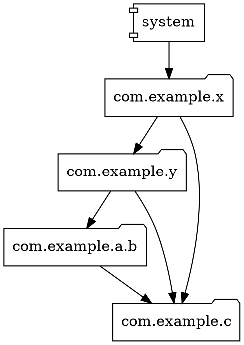
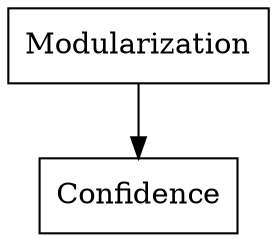
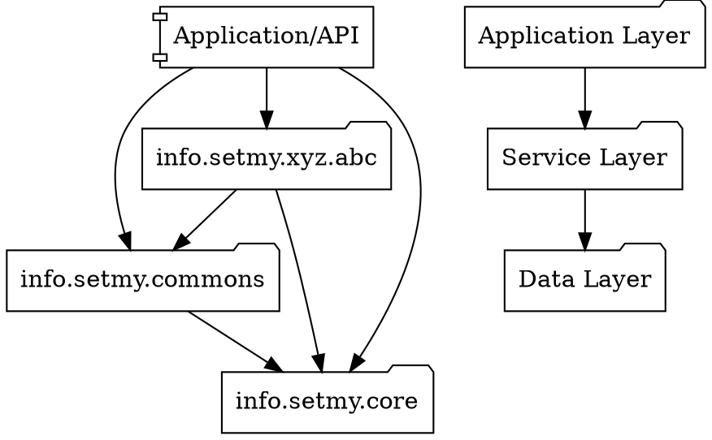
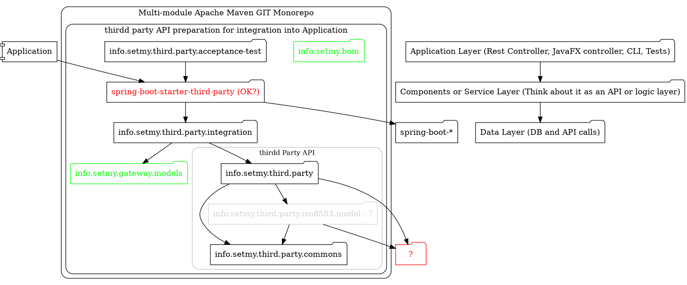

# DOT Language

## Information

## Installation

[Downloads](https://graphviz.org/download/)

### CentOS, Rocky Linux

### Windows

## Configuration

## Usage, tips and tricks

```shell
dot -Tsvg classes.dot -o classes.svg
dot -Tpng classes.dot -o classes.svg
```

### Coding tips and tricks

**packages.dot**

PackagesDiagram - can be any other name for graph.









**graph.dot**

GraphDiagram - can be any other name for graph.

```
/*
dot -Tsvg graph.dot -o graph.svg
*/
digraph GraphDiagram {

    Begin;
    End;

    node [shape = rect];

    Begin -> BOX1 [label = "When all starts"];

    BOX1 [label = "Interesting box"];

    BOX1 -> End [label = "When all ends"];
}
```

Shapes

```
    box
    polygon
    ellipse
    oval
    circle
    point
    egg
    triangle
    plaintext
    diamond
    trapezium
    parallelogram
    house
    pentagon
    hexagon
    septagon
    octagon
    doublecircle
    doubleoctagon
    tripleoctagon
    invtriangle
    invtrapezium
    invhouse
    Mdiamond
    Msquare
    Mcircle
    rect
    rectangle
    square
    star
    none
    underline
    cylinder
    note
    tab
    folder
    box3d
    component
    promoter
    cds
    terminator
    utr
    primersite
    restrictionsite
    fivepoverhang
    threepoverhang
    noverhang
    assembly
    signature
    insulator
    ribosite
    rnastab
    proteasesite
    proteinstab
    rpromoter
    rarrow
    larrow
    lpromoter
    record
    Mrecord
    squarebox
    circle
    diamond
    triangle
    none
```

## See also

* [DOT Language](https://graphviz.org/doc/info/lang.html)
* [graphviz](https://graphviz.org/)
* [Shapes](https://graphviz.org/doc/info/shapes.html)
* [Node attributes](https://graphviz.org/docs/nodes/)
* [Edge attributes](https://graphviz.org/docs/edges/)
* [Arrows](https://graphviz.org/doc/info/arrows.html)
* [graphstream](https://graphstream-project.org/)
* [dot-parser](https://github.com/Calpano/dot-parser)
* [graphviz-java](https://github.com/nidi3/graphviz-java)
