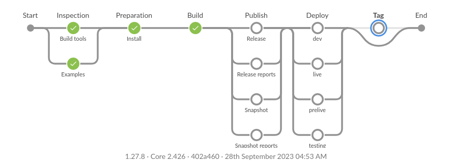
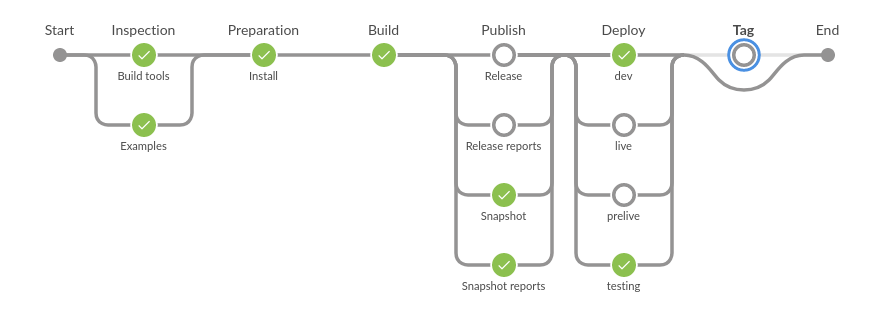
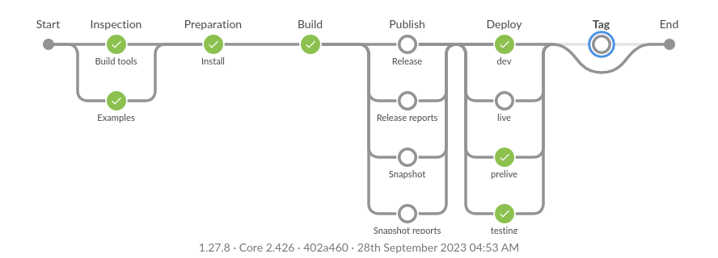
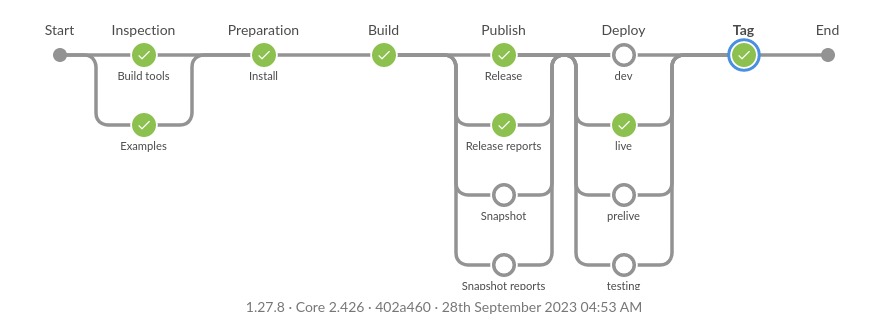

# Decisions and principles

## Decisions

### Microservices and API-s

All external or third party API-s by default should be behind internal API.

* actually can be more fault-tolerant
* more freedom (caching, DB, replace, re-desing external API or design, replace [later throw external out]).
* 2 types, that can be in one but clearly understandable, what can be used
  ** direct, that is 1:1 transferring and translating 3dp or external API
  ** complex or translated (strongly preferred), that is probably translating and doing many complex requests to 3dp/ex
  API

### Translations

    Should be:
    - used as one or in many formats (JSON, XML, JS, Java properties, YAML, ...), that can be requested for example with GET method
    - added at compile time
    - added, loaded or used at runtime (REST or other API), and probavly cached for runtime
    - in DB
    - versioned (versions can be 1:1 withh software version os independent)
    - by application, module or API
    - use camel case JS format as key ("someApplicationView.tooltip")
    - with user UI

### Developers

Preferred OS should be chosen for production machines, and developers should use that OS as a development machine.

- learning and collecting know-how

IDE - same IDE without configuration changes for all developers

That means:

- install
- start working

Instead:

- install
- remember to find documentation
- read documentation
- configure by documentation
- start working

### IDE

* IntelliJ (Java + others)
* PyCharm (Python)
* CLion (C/C++)
* NetBeans (Java, C/C++)

### Docker

    Images should based on developers maschines.
        - transferrign knowhow into Dockerfile. No differences and different thinking from developer machines.

    Organization should have its own Docker image hierarchy, consolitating security and knowhow in different hierarchy nodes by needs.

### Linux

In priority order (higher to lower): Rocky, Fedora linux, CentOS, Debian

Follow FHS: https://refspecs.linuxfoundation.org/FHS_3.0/fhs/index.html

Follow LSB: https://refspecs.linuxfoundation.org/lsb.shtml

By setmy.info standards, all packages should be unpacked (if possible) directly under /opt folder.

Examples:

- /opt/cmake-3.17.1-Linux-x86_64
- /opt/jdk-14.0.1
- /opt/firefox
- /opt/node-v12.18.1-linux-x64
- /opt/apache-maven-3.6.3

### Other OS

    In priority order (higher to lower): FreeBSD and OpenIndiana.

### Containers

    In priority order (higher to lower): Docker, Jail and Zone.
    Tools: Docker registry, Kubernetes for Docker. Probably should change, becase of RedHat new tools. Need to analyze these.
        (RancherOS, Helm ?)

### Front end

* Angular
* LESS
* Single-Page application
* PWA
* Responsive web design
* Cross-browser
    * IE11 (minimum IE)
* Jasmine FW
* Karma
* 3 Layer (Controller/controlling, Service, Resource/API)
    * Service layer independent of Frameworks (VueJS, Angular, React etc.), dependent on Axios (browsers' support
      **fetch**).

### Back end

* Standard language set
    * Java, Groovy, Clojure, Python, C/C++
* SpringBoot, Spring
* JSR-330
* 3 Layer (Controller/REST/SOAP/etc., Service, DAO/API/DataSource)
* JPA (Hibernate)
* Log4j2

3 modules (Application, implementation (services), models (also interfaces, exceptions, VO, DTO-s))

### Testing

* JUnit 5
* AssertJ
* Mockito
* Java + Selenium (hub and nodes)
* Cucumber

Test farm has to be built.

Smart devices and PC:

* iOS devices
* Android devices
    * Sony
    * Samsung
    * Nokia
* Windows devices

Resolutions

* https://allcolorscreen.com/my-screen-resolution

* Xiaomi Redmi Note 14 Pro+
    * FF:       508 x 1130
    * Chrome:   407 x 904
* Nokia G20
    * FF:       408 x 907
    * Chrome:   412 x 915
* Sony Xperia 10 I4113 https://www.gsmarena.com/sony_xperia_10-9353.php
    * FF:       360 x 840 ()
    * Chrome:   360 x 840 (3:7)

### DB

* H2
* PostgreSQL/Postgis
    * Tools: Liquibase
* MongoDB
* DGraph/Neo4J
* Lucene

### Layers responsibility

1. **Filters and exception handlers**

* 1.1 Should do security checks, if possible and meaningful to do these here
* 1.2 Error messages transformation to HTTP error codes and messages with data: translation key (no error code),
  additional data

2. **App/Controller/Resource/Scheduler**

* 2.1 Do security checks with calling security related service(s) before entering any (business) logic
* 2.2 Data transformations for calling (business) logic services. For example, DTOs to other class model data. Data
  mapper, transform or other services have to be called.
* 2.2 Logic service calls.
* 2.3 Ordinary exceptions to web exception transformation for error message transformations (1.2)

3. **API/Service**

* 3.1 Security check services
* 3.2 Data validation check services
* 3.3 Data transformation services
* 3.4 Logic services, data request and population services
* 3.5 Has its own data models and therefore...
* 3.6 Is independent of point 2 layer

4. **DAO/Repository/API**

* 4.1 Request objects from DB or from external API-s

### Decided tools, components and libraries

#### OS

1.1 DOCUMENTATION MOVED

#### Containers

2.1 DOCUMENTATION MOVED

2.2 DOCUMENTATION MOVED

3 Shell

3.1 Bourne shell and use #!/bin/sh not #!/bin/bash. The First one is in base installation of CentOS, Fedora, *BSD,
Solaris, Debian (*buntu), OpenIndiana etc.

3.2 Therefore a shell script should be not written in "bashism" (bash way), but as much as possible in POSIX shell
way.

3.3 Prefer shell first and if not possible or simpler, then Python 3.x.

#### UI

4.1 because HTML has no rich standard set of components, then we need write components by our selves.

4.2 IE 11 is still in use, therefore, that should be covered too.

4.3 Prefer CSS tool over JS tools to get UI results.

4.4 because of http2 push method we use old style resources (css, js) loading. Possible to make (if it is not
already done) tag library, that does push first for JSP or HTML loading.

4.5 Therefore and because of webpack we should support in JavaScript node packaging and

#### Logs

5.1 Logging should go to tailable file.

5.2 Logging should be with size limit; that means logs should be split after reaching the limit.

6 Build tools

6.1 For Java maven

6.2 Other build tools and helpers: cmake, ant, make (GNU?)

6.3 Webpack build tool for frontend tools.

6.4 Reporting building with maven using maven site, where site has integrated reports: JavaDoc (for main and test
code), pitest, OWASP dependencies check, JaCoCo unit test coverage, style check, version notes, todo notes, findbugs.

#### Tests

Unit tests (UT), Integration tests (IT), e2e tests (ET).

UT, IT, ET are top level suites.

UT in memory. Unit is method/function under test.

Mutation tests are executed only with unit tests. Test coverage is executed only with unit tests.

| Depend or can depend                                | UT  | IT      | ET      |
|-----------------------------------------------------|-----|---------|---------|
| Java (or other platform)                            | YES | YES     | YES     |
| JUnit                                               | YES | YES     | YES     |
| AssertJ                                             | YES | YES     | YES     |
| Mockito                                             | YES | YES     | NO      |
| Mutation testing                                    | YES | NO      | NO      |
| WireMock                                            | NO  | YES     | NO      |
| Environment variables                               | NO  | YES     | YES     |
| (Data) Files                                        | NO  | YES     | YES     |
| Config files                                        | NO  | YES     | YES     |
| DB                                                  | NO  | YES     | YES     |
| Network                                             | NO  | YES     | YES     |
| External system emulators                           | NO  | NO (1)  | YES     |
| Cucumber / Spec by example                          | NO  | NO      | YES     |
| JUnit Suites                                        | NO  | NO      | YES (4) |
| Gatling load testing                                | NO  | NO      | YES     |
| IDE config                                          | NO  | NO      | YES (3) |
| Encrypted secrets in code (5)                       | NO  | YES (2) | YES     |
| Use testable software internals (White box testing) | YES | NO (6)  | NO (7)  |

1. Prefer not to use, so mostly NO. Move them to ET. Manually, for development time.
2. Mostly YES, but prefer not to use.
3. If possible avoid, to hold principle "Checkout code and start working".
4. If possible avoid. If complicated set of tests and helps, use.
5. In test code
6. Mostly no, try not to use
7. Use end points onl

#### JavaScript (JS)

7.1 Prefer ECMAScript 6 - "Pure JS". Newer standards added a lot of other keywords and possibilities. Some of them
make code reading harder!

7.2 Prefer Pure JS to TypeScript.

7.3 Prefer code without "prototype". Just create an object and add properties.

7.4 Frontent JS

7.4.1 Use layered architecture: resources at bottom for data access and data fixing and normalization, service layer
top on that for ...

7.4.2 Prefer two-way data binding over event dispatch-catch.

#### Java

8.1. Prefer solutions to write code without interfaces. Interfaces are for frameworks or plugins, where N number of
third parties should implement something.

8.2. Java fail length up to 512 lines and line length 110.

#### Clojure

* With Leiningen. To switch to .edn, prepare requirements by Leiningen setup and prepare .edn and verify.

#### Source Controll

9.1. GIT over Mercurial

#### Misc

1. Hibernate
1. DB: PostgreSQL, MongoDB, DGraph (?)
1. MQ: RabbitMQ (should be used, when they hide problems? Replace it with Redis?), Mosquitto
1. Spring, Spring boot andMicronaut, but using as much as possible standard way (javax.*).
1. Semantic versioning: https://semver.org/
1. Solution levels
1. Only JWT check with symmetric keys. No session cancellation (JWT revoke). Fully stateless solutions. No central
   solutions cache for apps. Single node solutions. App backend as GW.
1. DB JWT check with symmetric keys. DB-based session cancellation and expiration (JWT revoke). Single node
   solutions. App backend as GW. No central cache solutions for apps.
1. DB JWT check with symmetric and asymmetric keys. DB-based session cancellation and expiration (JWT revoke). Multi
   node solutions. App backend as GW. No central cache solutions for apps.
1. Central Cache and session storage. JWT and session revoke in cache systems. Multi node solutions. Multi HW
   servers only.
1. Central Cache and session storage. JWT and session revoke in identity management systems. Multi node systems.
   Health checks. API GW (rate limiting, security, identity management, etc.). Multiple hardware (servers, network
   nodes, power supplies, UPS etc.) nodes. Storage systems.
1. Prefer standard or well defined or stable tools over self making tools.
1. Xfce is class desktop environment.

## Application configuration

Overload (overwritten from top to down) order

| **Order**                                   |
|---------------------------------------------|
| Defaults in code                            |
| File (**.yaml** overwrites **.properties**) |
| Environment variables                       |
| CLI                                         |

Variable naming convention

|                                           | **Prefix**                 |
|-------------------------------------------|----------------------------|
| File<br/>**properties**<br/>**yaml**<br/> | <br/>**smi.**<br/>**smi:** |
| Environment variables                     | **SMI_**                   |
| CLI                                       | **--smi-**                 |

```properties
smi.xyz=abc,def,ghi
```

```yaml
smi:
    xyz: abc,def,ghi
```

```shell
SMI_XYZ=abc,def,ghi
```

```shell
abx --smi-xyz=abc,def,ghi
```

Names after prefix:

| Configuration option              | properties | yaml | Environment variables suffix | CLI options suffix     | Notes |
|-----------------------------------|------------|------|------------------------------|------------------------|-------|
| Profiles                          | -          | -    | PROFILES                     | -profiles              |       |
| Config paths                      | -          | -    | CONFIG_PATHS                 | -config-paths          |       |
| Optional application config files | -          | -    | OPTIONAL_CONFIG_FILES        | -optional-config-files |       |
| Application name                  | -          | -    | NAME                         | -name                  |       |

### CI, Jenkins

Master should have stable and verified and re-releasable any moment code.

Merging means also software installation to some environment. Work merged to master means going automatically to live.

To **develop** merging is after successful code review by developer(s). **Branch have to be merged fast**, because most
cases QA is bottleneck. If needed, release branch can be used for **code freeze** (for QA manual testing) - try to avoid
and do in sprint/iteration testing and increase automatic testing.

To **release** and **master** merging is organizational (QA, developers, board, etc.) decision.

| Branch  | Environment         | Branch name          | Artifacts published                    | Tag                   | Notes                                     |
|---------|---------------------|----------------------|----------------------------------------|-----------------------|-------------------------------------------|
| feature | -                   | feature/xxxxxxxxxxxx | -                                      | -                     |                                           |
| develop | dev, test           | develop              | snapshot software and snapshot reports | -                     | Can go only to dev env, skip test deploy. |
| release | dev, test, pre-live | release/1.0.0        | -                                      | -                     | Can skip dev env. deploy.                 |
| master  | live                | master               | release software and release reports   | automatically created |                                           |

#### Stages

1. **Inspection** verifies build environment requirements (OS, Java, node, npm versions, existence, ...).
2. **Preparation** prepares (installs) build environment settings, tool, software, components.
3. **Build** builds main software and verifies code - test coverages, code inspections...
4. **Publish** uploads artifacts (to file servers, storage, artifactory, ...).
5. **Deploy** installs (published) software on environment.

NB! We consider artifact re-creation from source as low level or too small risk. We don't use same built artifacts for
dev, test, pre-live and live. We put more effort into inspection and build verification stages, to lover risk, that
packages are created differently in different branches. In most cases we are using specific Java Docker images with
concrete version and maven is used by wrapper (also concrete version). Same JDK and maven should produce same results.
Possibility that it's not so, is too small.

QA **manual tests** are executed on **development** branch.

#### Feature



#### Develop



#### Release



#### Master



## Other

1. [No addons, extensions, plugins into git](noGitAddons.md)
1. [No release by VCS tag](noReleaseByVCSTag.md)
1. [No secrets in main VCS](noSecretsInMainVCS.md)
1. [Maven](maven.md)
1. [Cucmber tests principles](cucumberTestsPrinciples.md)
1. [Branching](branching.md)
1. [CI Jenkins](ciJenkinsOvergitGitHuLa.md)
1. [Constant upgrades](constantUpgrade.md)
1. [C++](cppDecisions.md)
1. [Developer first](developerFirst.md)
1. [File structure](fileStructure.md)
1. [Login once](loginOnce.md)
1. [No binaries in VCS](noBinariesInVCS.md)
1. [No Node in back-end](noNodeJSBackend.md)
1. [No rewrite branch](noRewriteBranch.md)
1. [No VueJS In Big apps](noVueJSInbigApplications.md)
1. [PWA first](pwaFirst.md)
1. [Self managed repos](shouldHaveSelfManagedRepos.md)
1. [Should have VCS hash](shouldHaveVCShash.md)
1. [UI requirements](uiRequirements.md)
1. [Versioning](versioning.md)
1. [Arch as code](architectureAsACode.md)
1. [JPA entities](jpaEntitiesAndDTOs.md)
