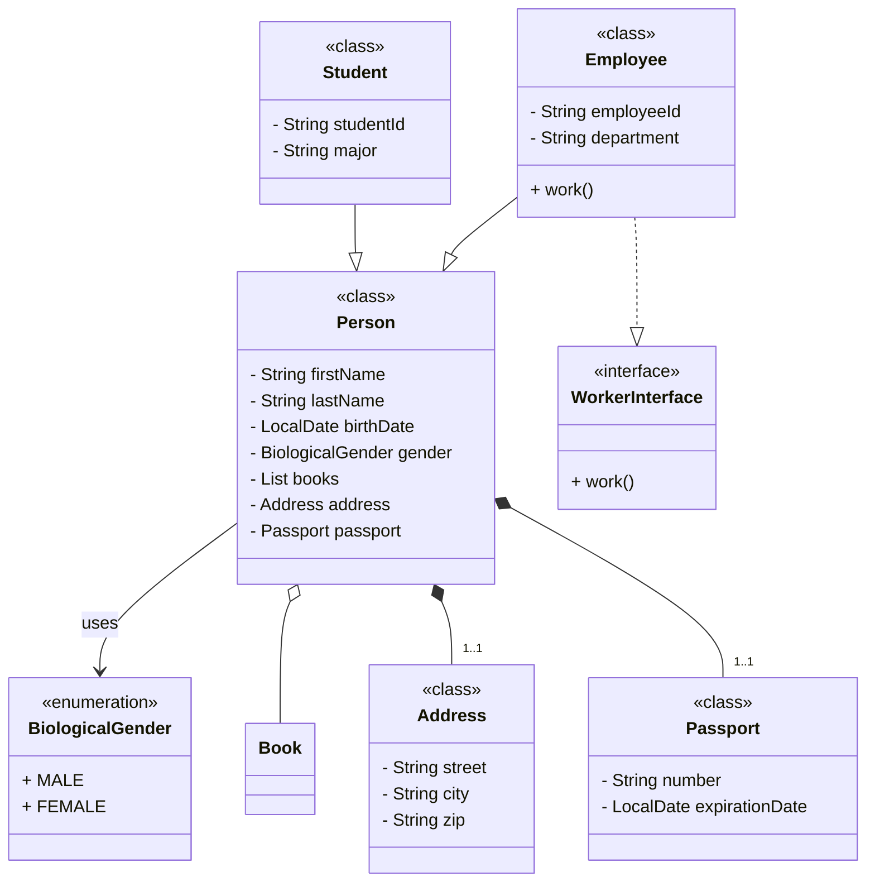

# Mermaid

## Information

## Installation

```shell
npm install -g @mermaid-js/mermaid-cli
mmdc --version
mmdc -i input.mmd -o output.svg
```

## Usage, tips and tricks



### Coding tips and tricks

## See also

* [Mermaid](https://mermaid.js.org/)
* [Mermaid tutorial](https://mermaid.js.org/ecosystem/tutorials.html)
