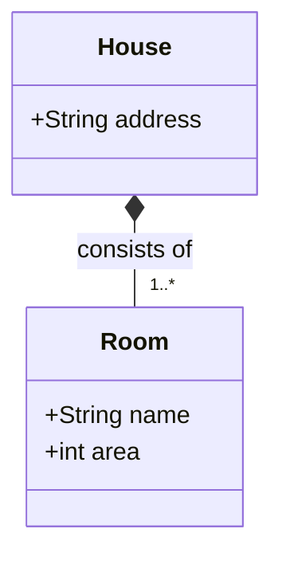
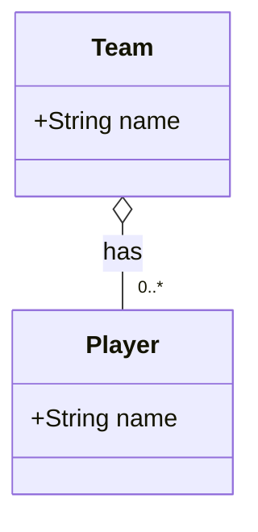

# UML

## Information

### Association

### Composition

Strict association.

A Room can't exist without a House. If the House is destroyed, the Room is destroyed as well.

### Aggregation

Soft association.

Players can exist independently of a Team.

Aggregation is well-suited for linking to enum-like reference tables, where the associated values are shared, reusable,
and not owned exclusively by the referring object.

### Generalization

### Dependency

**Web Shopping** package uses (depends on) **Payment** package.

Interface **SiteSearch** is realized (implemented) by **SearchService**.

## Usage, tips and tricks

### Coding tips and tricks

## See also

* [OMG](https://www.omg.org/spec/UML/2.5.1/PDF)
* [uml](https://www.uml-diagrams.org/)
* [composition](https://www.uml-diagrams.org/composition.html)
* [aggregation](https://www.uml-diagrams.org/aggregation.html)
* [association](https://www.uml-diagrams.org/association.html)
* [generalization](https://www.uml-diagrams.org/generalization.html)
* [dependency](https://www.uml-diagrams.org/dependency.html)
